# AUTO CAR

 

# LOGO AUTO CAR

 

Jelajahi destinasi Anda dengan kenyamanan dan gaya bersama layanan rental mobil kami yang terpercaya. Kami menyediakan armada kendaraan berkualitas tinggi, siap mengantar Anda dalam setiap perjalanan. Nikmati kebebasan untuk menjelajahi tempat-tempat menarik tanpa khawatir transportasi, karena kami menawarkan pilihan mobil yang memenuhi berbagai kebutuhan perjalanan Anda. Dengan proses pemesanan yang mudah dan cepat, kami memastikan pengalaman rental mobil Anda menjadi lancar dan memuaskan. Selalu siap mengantarkan Anda menuju pengalaman perjalanan yang tak terlupakan, sewa mobil bersama kami untuk petualangan tanpa batas!

## Kelompok 2

<table border="1">
  <thead>
    <tr>
      <td>No</td>
      <td>NIM</td>
      <td>Nama Anggota</td>
    </tr>
  <thead>
  <tbody>
    <tr>
      <td>1</td>
      <td>15210450</td>
      <td>ALIF FIRMAN HAKIM</td>
    </tr>
    <tr>
      <td>2</td>
      <td>15220572</td>
      <td>JUAN EUAGGELION SERAN</td>
    </tr>
    <tr>
      <td>3</td>
      <td>15220828</td>
      <td>MARIA ERVIANA ASINTA LENSI</td>
    </tr>
    <tr>
      <td>4</td>
      <td>15220498</td>
      <td>MUHAMMAD ZINEDINE ZIDANE</td>
    </tr>
    <tr>
      <td>5</td>
      <td>15220257</td>
      <td>SHAFIQ NAJWAN</td>
    </tr>
  </tbody>
</table>

## 💻 Pengguna Sistem

Pengguna yang dapat memakai sistem ini adalah Admin & User.

## 👨‍💻 Skenario Kebutuhan Pengguna

### Admin

<ol>
  <li>Admin dapat melakukan login.</li>
  <li>Admin dapat melihat, menambahkan, memperbarui, dan menghapus data Mobil.</li>
  <li>Admin dapat melihat, menambahkan, memperbarui, dan menghapus data Tipe Mobil.</li>
  <li>Admin dapat melihat, menambahkan, memperbarui, dan menghapus data Transaksi.</li>
  <li>Admin dapat melihat, menambahkan, memperbarui, dan menghapus data User.</li>
  <li>Admin dapat melihat, menambahkan, memperbarui, dan menghapus data Pesan.</li>
  <li>Admin dapat melihat Laporan Transaksi.</li>
  <li>Admin dapat mengganti password.</li>
</ol>

### User

<ol>
  <li>User dapat melakukan login.</li>
  <li>User dapat melihat list mobil yg tersedia</li>
  <li>User dapat menyewa mobil</li>
  <li>User dapat melihat riwayat sewa</li>
  <li>User dapat mengirim kotak pesan</li>
  <li>User dapat mengganti password.</li>
</ol>

## 🖼️ Screenshot Aplikasi

<table width="100%">
  <tbody>
    <tr>
      <td width="33%">
        <h5>Beranda</h5>
        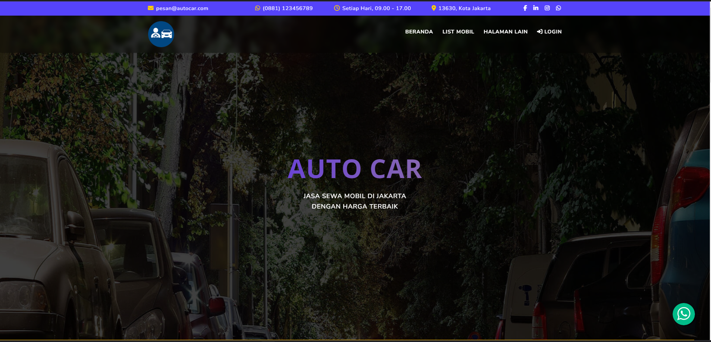 
      </td>
      <td width="33%">
        <h5>Halaman List Mobil</h5>
        
      </td>
      <td width="33%">
        <h5>Halaman FAQS</h5>
        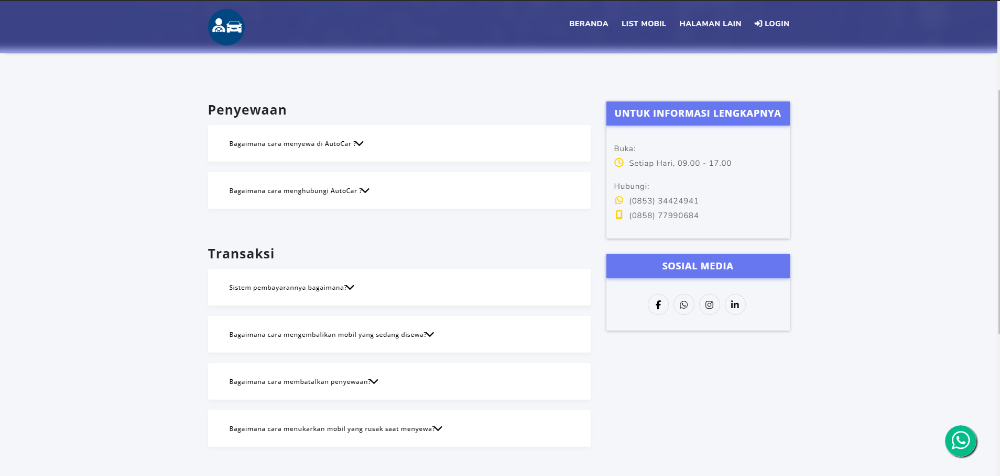
      </td>
      <td width="33%">
        <h5>Halaman About Us</h5>
        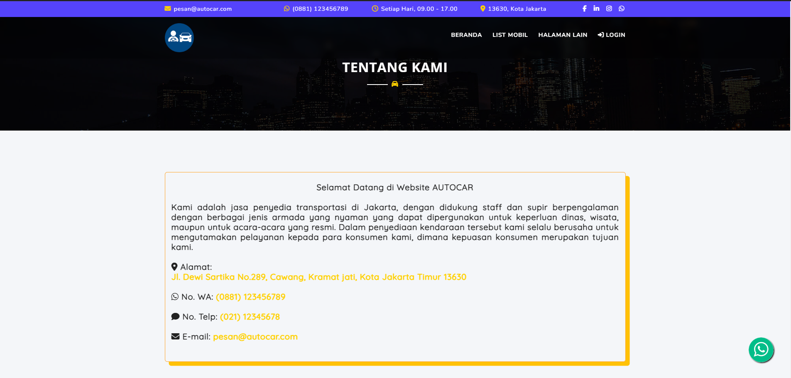
      </td>
      <td width="33%">
        <h5>Halaman Riwayat Sewa</h5>
        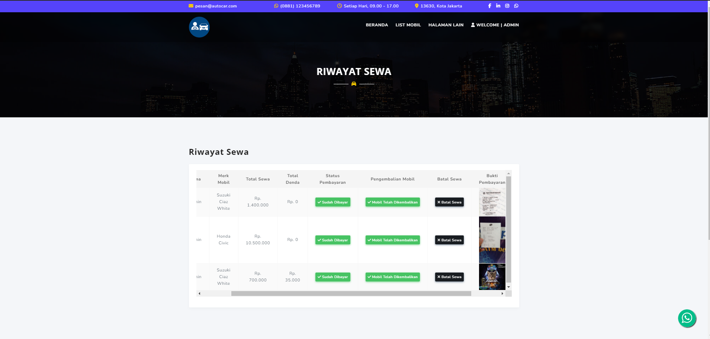
      </td>
      <td width="33%">
        <h5>Halaman Login</h5>
        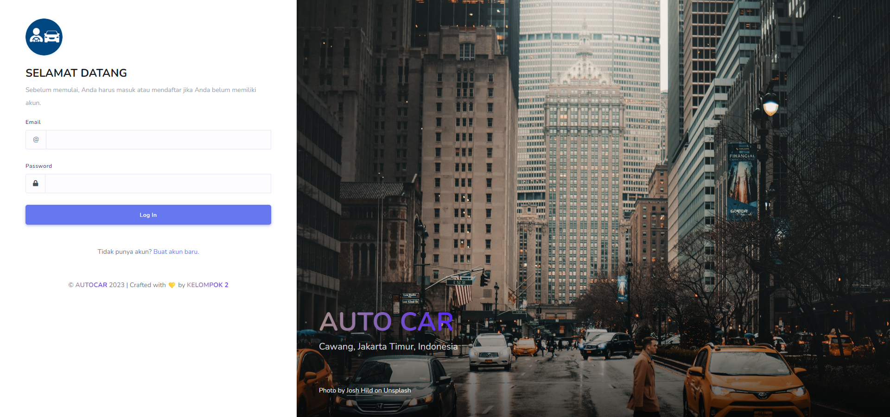
      </td>
      <td width="33%">
        <h5>Halaman Registrasi</h5>
        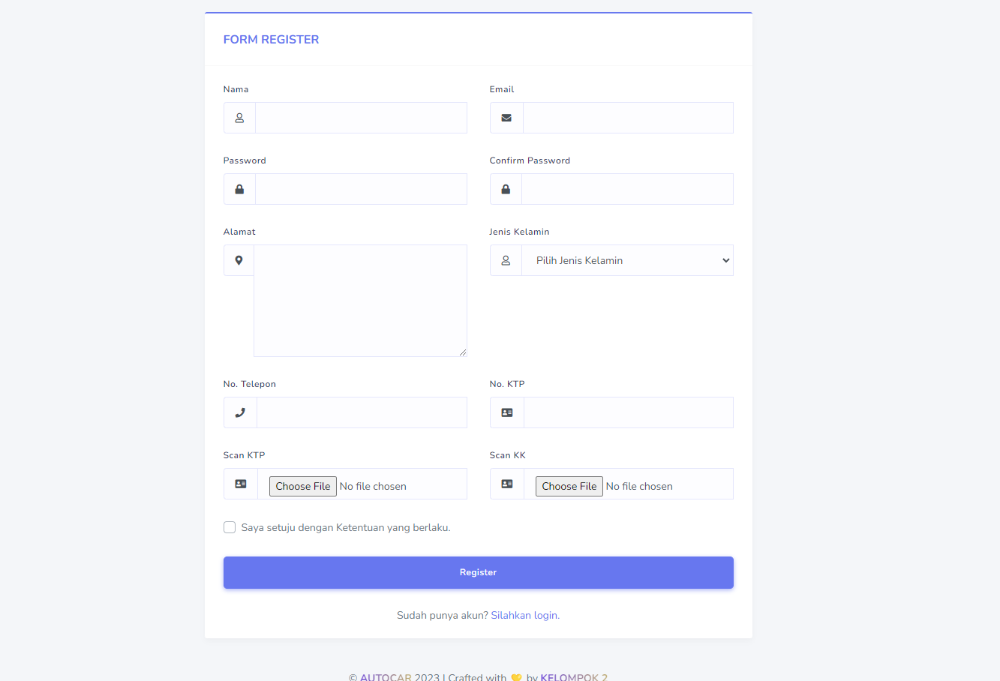
      </td>
      <td width="33%">
        <h5>Halaman Ganti Password</h5>
        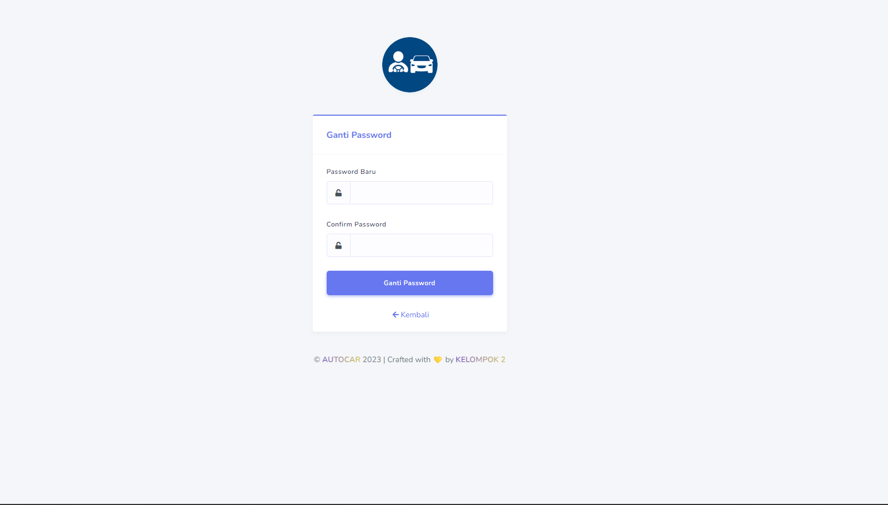
      </td>
    </tr>
  </tbody>
</table>

<table width="100%">
  <tbody>
      <td width="33%">
        <h5>Halaman Data Mobil</h5>
        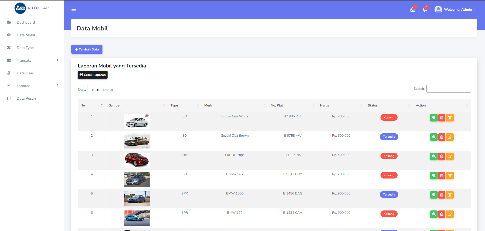
      </td>
      <td width="33%">
        <h5>Halaman Data Tipe Mobil</h5>
        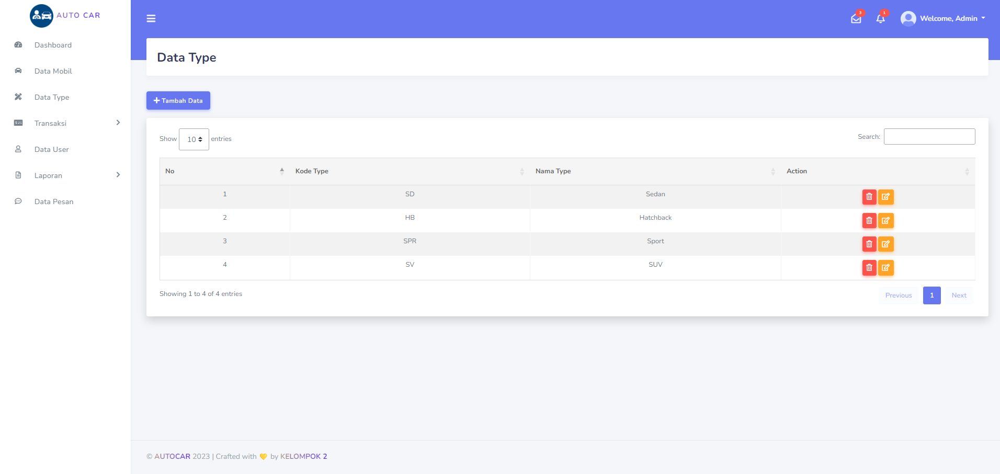
      </td>
      <td width="33%">
        <h5>Halaman Data Transaksi</h5>
        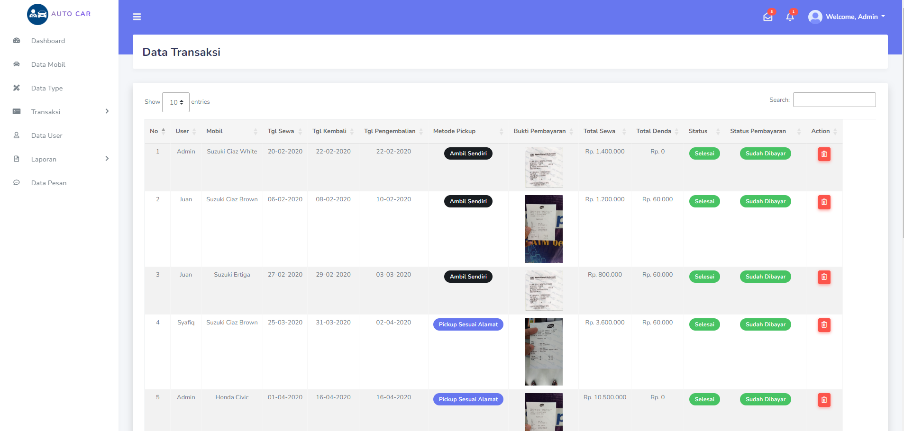
      </td>
      <td width="33%">
        <h5>Halaman Cetak Laporan</h5>
        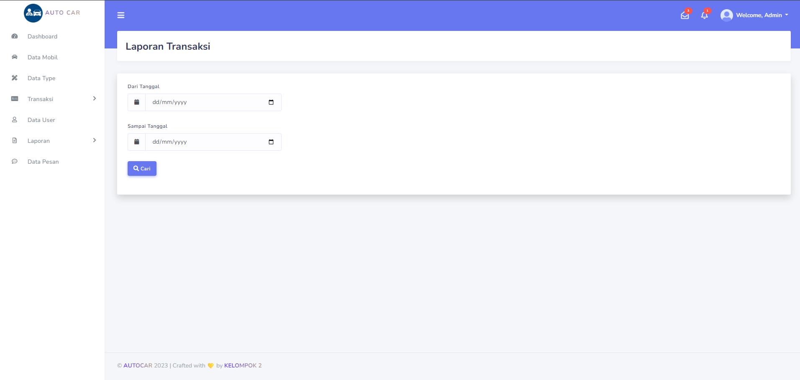
      </td>
      <td width="33%">
        <h5>Halaman Data Pesan</h5>
        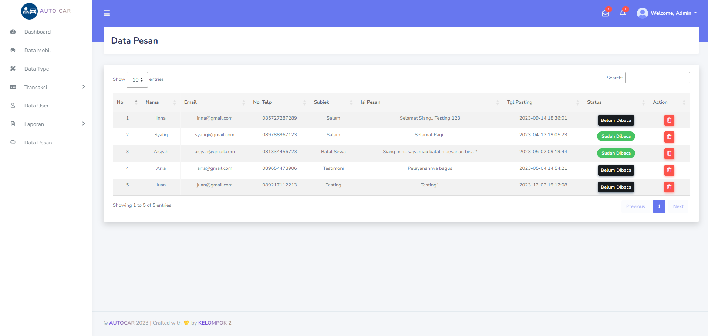
      </td>
  </tbody>
</table>

## Credit

Kami sangat berTerimakasih kepada Dosen Mata Kuliah Web Programming 1 kami yaitu Ibu Ainun Zumarniansyah, S.Kom, M.Kom. yang telah membimbing kami selama ini dan
Tentunya tidak lepas dari dukungan semua pihak yang telah membantu baik secara moril maupun materil.
